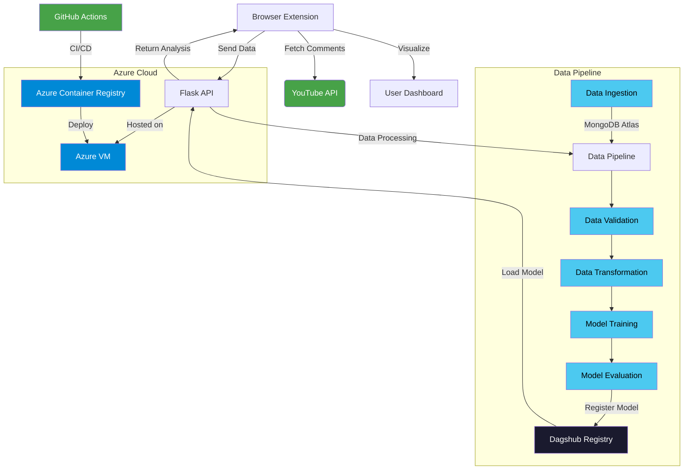
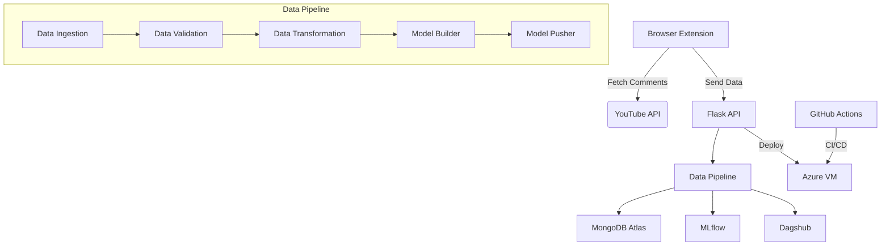
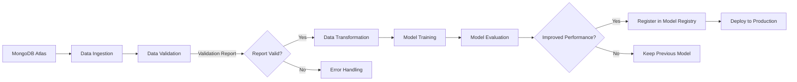
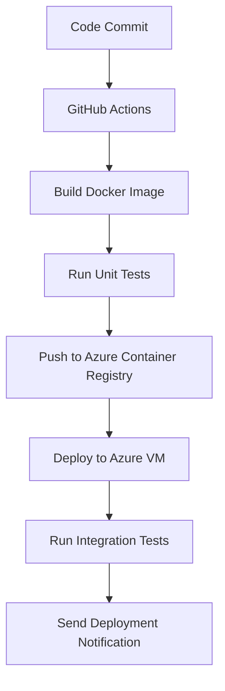

# TubePluse - YouTube Comment Sentiment Analyzer

<div align="center">
  
  
  [](https://addons.mozilla.org/)
  [](https://opensource.org/licenses/MIT)
  [](https://mlflow.org/)
  [](https://azure.microsoft.com/)
</div>

## 🌟 Transform YouTube Comments into Actionable Insights

TubePluse is a cutting-edge browser extension that analyzes sentiment in YouTube comments using advanced machine learning. Gain instant insights into audience reactions through beautiful visualizations and data-driven metrics.


## 🎥 Demo Video
https://github.com/user-attachments/assets/da273429-f3af-4f8b-bc7f-a5f74b0a7566 


## ✨ Key Features

| Feature | Description | Visualization |
|---------|-------------|--------------|
| **Sentiment Analysis** | Real-time classification of comments into Positive/Negative/Neutral |  |
| **Word Cloud** | Visual representation of most frequent words |  |
| **Top Comments** | Curated list of most impactful comments |  |
| **Automated Pipeline** | End-to-end MLOps workflow |  |

## 🚀 How It Works

### System Architecture



### Workflow Overview

1. **User activates extension** on YouTube video page
2. **Comments fetched** (up to 1000 comments)
3. **Data sent to backend** for processing
4. **ML pipeline executes**:
   - Data validation and transformation
   - Model training and evaluation
   - Model registration in Dagshub
5. **Results returned** to extension
6. **Interactive dashboard displayed** with visualizations

## 🛠️ Technical Implementation

### Automated ML Pipeline



### Technology Stack

**Core Components**  
<div>
  
  
  
  
</div>

**MLOps Infrastructure**  
<div>
  
  
</div>

**Cloud Deployment**  
<div>
  
  
  
</div>

## 🧩 Installation & Setup

### Browser Extension
Available on Firefox Addons Marketplace:  
[](https://addons.mozilla.org/)

### Local Development
```bash
# Clone repository
git clone https://github.com/yourusername/tubepluse.git
cd tubepluse

# Set up virtual environment
python -m venv .venv
source .venv/bin/activate

# Install dependencies
pip install -r requirements.txt

# Run backend server
cd backend
python app.py

# Load extension in browser
1. Enable developer mode in browser
2. Load unpacked extension from /extension directory
```

## 🔄 CI/CD Pipeline



## 📊 Results Visualization

<div align="center">
  
  
  
</div>

## 🤝 Contributing

We welcome contributions! Follow these steps:

1. Fork the project
2. Create your feature branch (`git checkout -b feature/AmazingFeature`)
3. Commit your changes (`git commit -m 'Add some AmazingFeature'`)
4. Push to the branch (`git push origin feature/AmazingFeature`)
5. Open a pull request

## 📄 License

Distributed under the MIT License. See `LICENSE` for more information.

## 📧 Contact

Project Lead: [Your Name](mailto:your.email@example.com)  
[](https://github.com/yourusername/tubepluse/issues)

